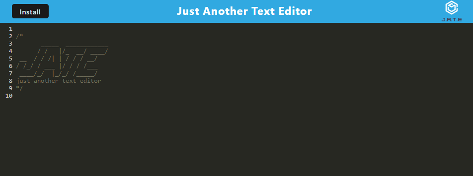

# Just-Another-Text-Editor

Online text editor that can be downloaded and used offline as well.

## Table of Contents
- [Application](#installation)
- [Usage](#usage)
- [Contributing](#contributing)
- [Question](#questions)

## Application
### Application Screenshot


### Website
https://lit-sands-00959.herokuapp.com/ 

## Usage
JATE is a text editor that utilizes PWA model for offline usage and uses ```idb``` for storage.

## Questions
[jcgcristel's GitHub](https://github.com/jcgcristel)

For additional questions, you can email me at [jcg.cristel@gmail.com](mailto:jcg.cristel@gmail.com.).

